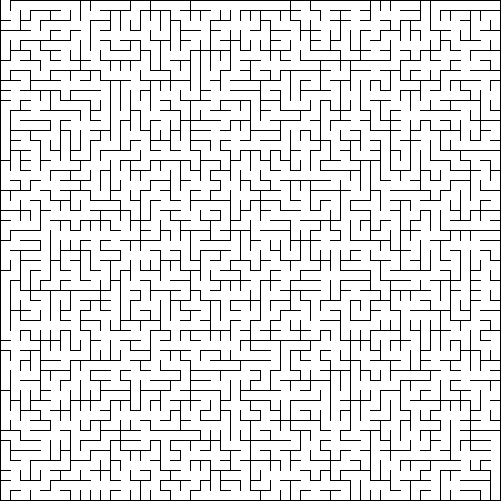
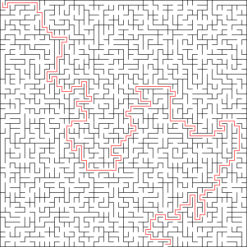

# mp_mazes from CS 225
Implemented a disjoint set in order to create a randomized maze. The maze is then solved using a BFS algorithm.

## Files Writte/Modified
- dsets.cpp/h
- maze.cpp/h
- main.cpp

## To Run the Code
Note: You need clang++, libc++, and lc++abi installed in order to compile.
1. Run the makefile using ```make```
2. Run ```./mazes```
3. It will create a 50x50 maze named ```regular.png``` and a solved version of the same maze named ```regularSolved.png```

## Sample Mazes
__Unsolved Maze__



__Solved Maze__


